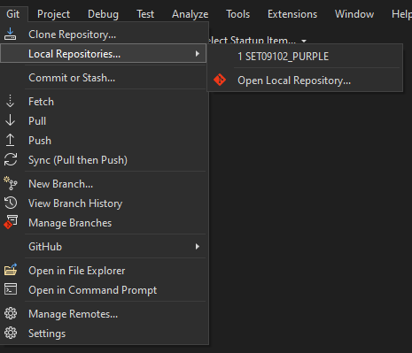

Development environment setup
First thing I did after installing VS 2022 from the Microsoft website was to link my Github account, on image1 it can be seen how it looks after doing so.

Potential alternative config settings
While setting my development environment up I didn't face any inconveniences, but I could see how someone using a different Operating System to Windows could face some problems as Visual Studio is not available for them, therefore one potential alternative would be to use a different IDE.
