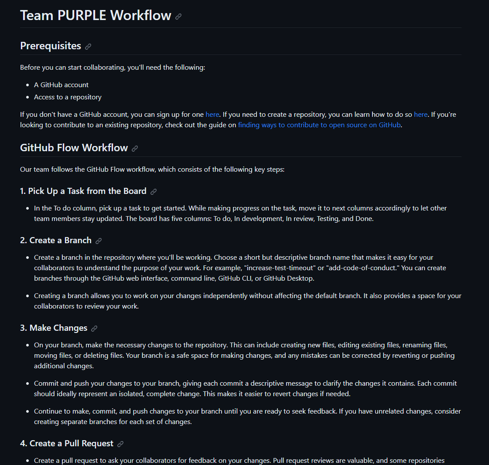
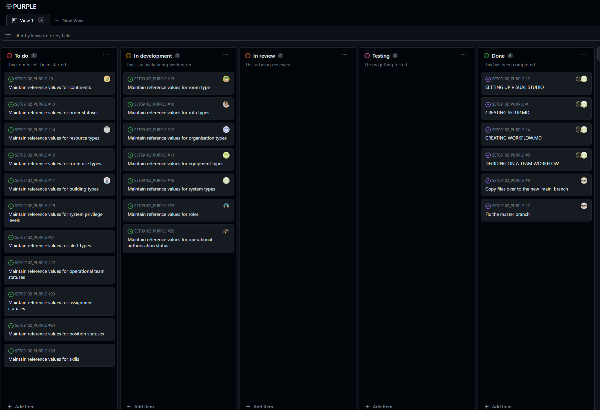

First within the team we decided to create a file in the Documentation explaining how does the workflow work, this file is shown on image3 below:
\
After making the explanatory file a Kanban board was created as well as issues and these were added to it, people selected some of them and started working. After some changes were made to the original explanatory file to make the explanation clearer.
\
